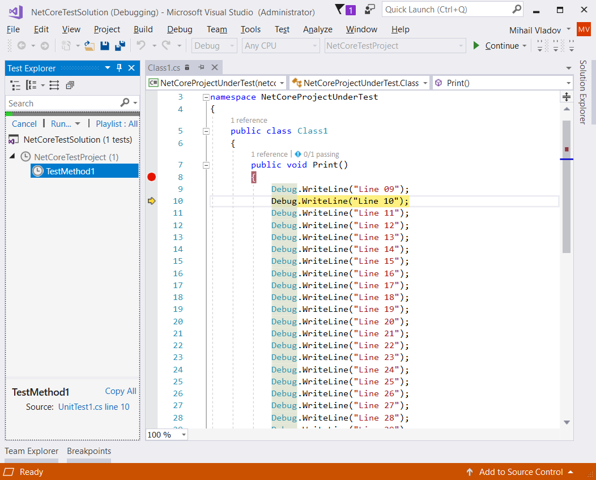

## Debug NetCore Problem description
The debugger arrowhead pointer (highlighted line) is not positioned to the correct execution line when debugging .Net Core with profiler enabled. 
Stepping the code line by line advances the pointer based on the initial offset/messed position. 
When the arrowhead leaves the method the remaining lines are executed at once.

SampleProfiler uses Profiling API to inject a several dummy lines at the beginning of the methods by handling ICorProfilerCallback::JITCompilationStarted event. The final code looks like as following:

```
0000:  nop
0001:  nop

0002:  ldc.i4     0 
0004:  brfalse    0008

0005:  nop
0006:  nop
0007:  nop
0008:  nop

0009:  ...

       <the original code goes here>

       ...        
```

## Steps to reproduce the problem
- Open Developer Command Prompt
- Navigate to the solution folder
- Call 'run-devenv.bat' script to start Visual Studio with enabled profiler
- Put a breakpoint inside NetCoreProjectUnderTest.Class1.Print method, for example at file: $(SolutionDir)\NetCoreProjectUnderTest\Class1.cs, line:9
- Debug test method NetCoreTestProject.UnitTest1.TestMethod1

**Actual Result**:
The highlighted line differs from the line of the breakpoint


**Expected result**:
Both highlighted and breakpoint lines should be the same 

Visual Studio 2017 was used to perform the test
